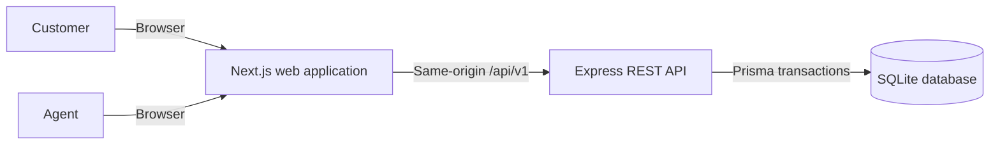
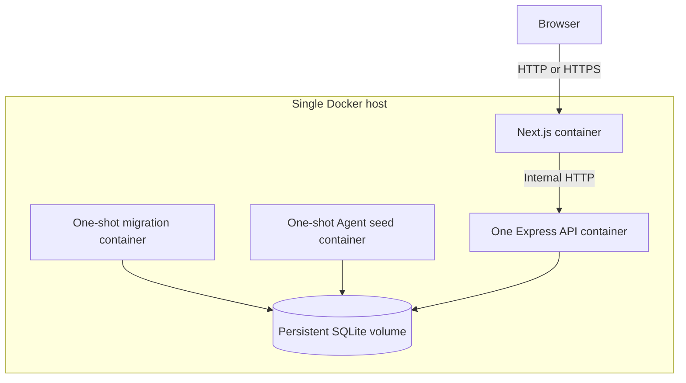
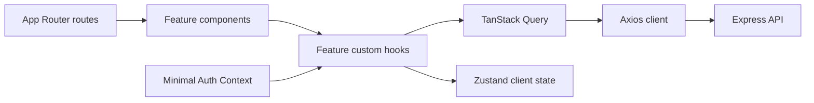
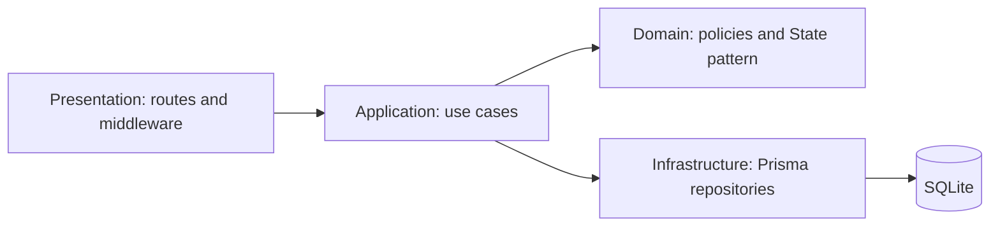
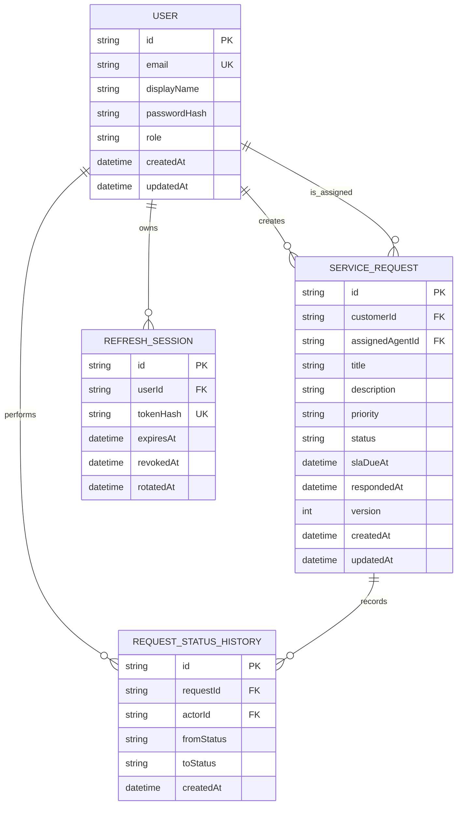
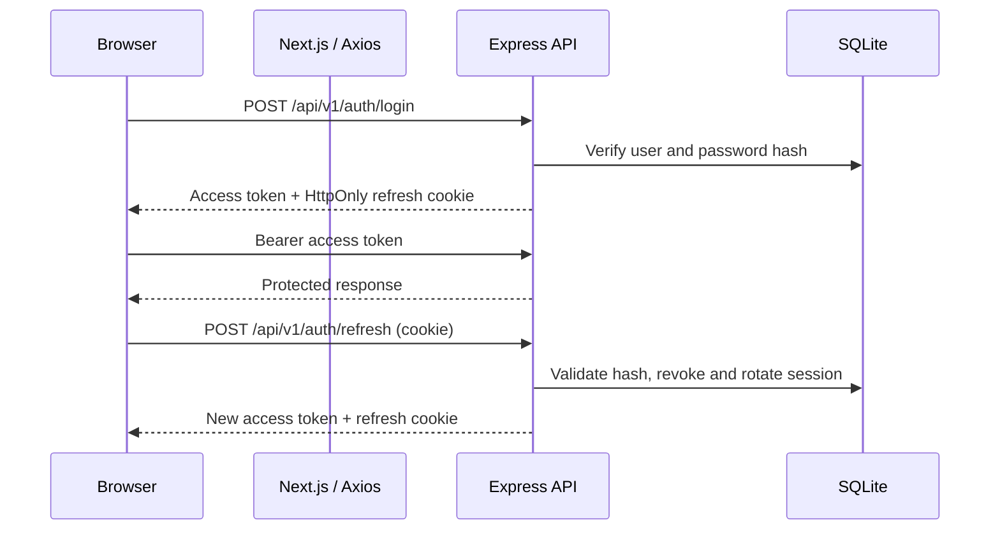
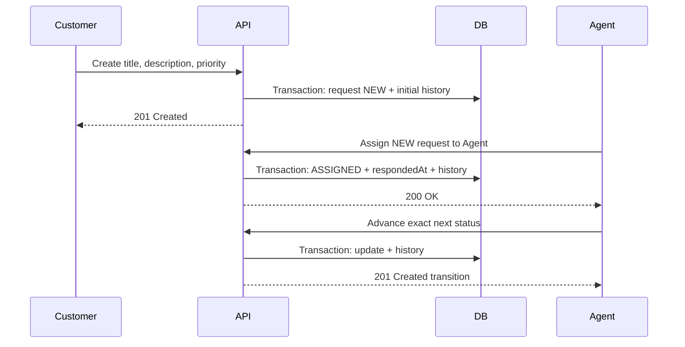
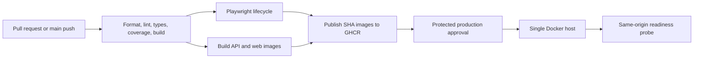

# Service Request Tracker: System Design

## 1. Scope

The system lets Customers register, authenticate, create service requests, and
view only their own requests. Agents can view all requests, assign a request to
an Agent, and advance requests through a controlled lifecycle.

The core lifecycle is linear:

```text
NEW -> ASSIGNED -> IN_PROGRESS -> RESOLVED -> CLOSED
```

The first assignment is the initial response for SLA purposes. Every lifecycle
change is recorded with the actor, source status, destination status, and UTC
timestamp.

Phases 1 through 4 establish the architecture, contracts, persistence model,
operational shell, container topology, authentication, RBAC, request REST API,
State-pattern lifecycle, backend integration tests, frontend session bootstrap,
typed Axios transport, Zustand state, TanStack Query hooks, role-aware request
workflows, status history, and live SLA presentation.

## 2. System Context



The browser has one public origin. Next.js serves the interface and proxies
`/api/v1/*` and `/api/health/*` to Express. The proxy does not contain business
logic. Express remains the only authority for authentication, authorization,
validation, lifecycle changes, and persistence.

## 3. Container View



Compose initializes volume ownership, applies migrations, runs the idempotent
Agent seed, starts one API instance, waits for API health, and then starts the
web container. SQLite requires exactly one API writer instance.

## 4. Component Design

### Web application



- `src/features/auth` owns session bootstrap, login and registration hooks,
  Auth Context, and the Zustand session store.
- `src/features/requests` owns request API functions, query keys, custom hooks,
  filters, SLA presentation, and request UI.
- TanStack Query is the source of truth for remote request data.
- Zustand stores only in-memory authentication data and client-only UI state.
- Auth Context provides session bootstrap and provider orchestration. It keeps
  Context API use narrow while satisfying the assessment requirement.
- Components do not call Axios or TanStack Query directly. Feature custom hooks
  expose application-oriented operations.
- Axios is retained alongside Next.js because the browser-facing dashboard uses
  TanStack Query against a separate Express REST API. Its interceptors attach
  bearer tokens, normalize errors, and coordinate refresh behavior.
- Concurrent protected `401` responses share one refresh promise, rotate the
  HttpOnly cookie once, update Zustand, and retry their original requests.
- Feature API functions parse responses with shared Zod contracts before data
  enters the Query cache.
- Request mutations update the detail cache and invalidate request lists.
  Logout cancels and clears all user-scoped queries.
- The dashboard renders dense desktop tables and compact mobile rows from the
  same role-filtered query. Request details and actions use responsive Sheets.
- SLA indicators update unanswered requests every second and freeze the result
  at `respondedAt` after assignment.

### Express API



Each backend feature follows the same dependency direction:

```text
presentation -> application -> domain
                         \-> infrastructure
```

Domain and application code do not depend on Express. Prisma remains behind
infrastructure boundaries. Controllers translate HTTP input and output only.
The Express application factory receives external dependencies, which allows
health and future route behavior to be tested without opening a network port.

## 5. Data Model



Important invariants:

- Emails are normalized before persistence and unique.
- Public registration always creates a Customer. Agent accounts are seeded or
  provisioned by a trusted administrative process.
- A `NEW` request has no assignee and no response timestamp.
- Every later status has an assignee and a response timestamp.
- `version` is nonnegative and supports optimistic concurrency checks.
- History rows only accept the initial event or one exact forward transition.
- Prisma and Zod enforce enums in application code. SQLite `CHECK` constraints
  independently reject invalid role, priority, status, and transition values.
- User and request deletion is restricted where audit history would otherwise
  lose its subject or actor.

Indexes support customer request lists, global Agent queues, assigned-Agent
queues, status filters, active SLA scans, history ordering, and refresh-session
lookup.

## 6. Authorization Matrix

| Operation                       | Customer | Agent                              |
| ------------------------------- | -------- | ---------------------------------- |
| Register as Customer            | Allowed  | Not applicable                     |
| Register as Agent publicly      | Denied   | Denied                             |
| View own requests               | Allowed  | Allowed through all-request access |
| View another Customer's request | Denied   | Allowed                            |
| Create request                  | Allowed  | Denied                             |
| Assign a `NEW` request          | Denied   | Allowed                            |
| Assign to a Customer            | Denied   | Denied                             |
| Advance an assigned request     | Denied   | Assigned Agent only                |
| Skip or reverse a status        | Denied   | Denied                             |

The API applies this matrix on every operation. UI route guards improve the user
experience but are not security controls. Inaccessible request identifiers
return `404` to avoid confirming another Customer's resource exists.

## 7. State Pattern

Request lifecycle behavior uses the State pattern. A `RequestLifecycle` context
delegates transition validation to a concrete state for `NEW`, `ASSIGNED`,
`IN_PROGRESS`, `RESOLVED`, or `CLOSED`.

Each state exposes only its exact next status:

| Current state | Allowed next state | Additional rule               |
| ------------- | ------------------ | ----------------------------- |
| `NEW`         | `ASSIGNED`         | Target user must be an Agent  |
| `ASSIGNED`    | `IN_PROGRESS`      | Caller must be assigned Agent |
| `IN_PROGRESS` | `RESOLVED`         | Caller must be assigned Agent |
| `RESOLVED`    | `CLOSED`           | Caller must be assigned Agent |
| `CLOSED`      | None               | Terminal state                |

This pattern centralizes transition behavior and follows the Open/Closed
Principle: a new lifecycle state can be introduced through another state object
without scattering status conditionals across controllers and repositories.

Assignment or advancement performs these actions in one short transaction:

1. Read the request and expected `version`.
2. Apply role, assignee, and State-pattern rules.
3. Update the request with status and version preconditions.
4. Insert the immutable history event.
5. Commit both writes, or commit neither.

An update count of zero indicates a concurrent modification and returns `409`.

## 8. Authentication Flow

The implemented session model uses a short-lived JWT access token and a
rotating, opaque refresh token:



- Access tokens remain in memory, not Local Storage.
- Refresh tokens are random, stored only as hashes, and sent in `HttpOnly`,
  `Secure` production cookies with an appropriate `SameSite` policy.
- Axios attaches the access token and uses one shared refresh promise so several
  concurrent `401` responses cannot create a refresh-token race.
- Logout revokes the refresh session and clears the cookie.

## 9. Request and SLA Flow



Response targets are:

| Priority |    Target |
| -------- | --------: |
| Urgent   |   2 hours |
| High     |   8 hours |
| Normal   |  48 hours |
| Low      | 120 hours |

Creation starts the clock. The due time is persisted in UTC as `slaDueAt`.
Initial assignment sets `respondedAt` once and freezes the response outcome.
While unassigned, the web application derives remaining time from the current
time and `slaDueAt`. After assignment, it compares `respondedAt` with
`slaDueAt`. A redundant mutable `breached` flag is not stored.

## 10. REST Surface

All business endpoints are versioned under `/api/v1`.

| Method | Endpoint                                   | Purpose                                   |
| ------ | ------------------------------------------ | ----------------------------------------- |
| `POST` | `/auth/register`                           | Register Customer                         |
| `POST` | `/auth/login`                              | Authenticate user                         |
| `POST` | `/auth/refresh`                            | Rotate refresh session                    |
| `POST` | `/auth/logout`                             | Revoke current refresh session            |
| `GET`  | `/agents`                                  | List valid assignment targets             |
| `GET`  | `/service-requests`                        | Role-filtered list with status/pagination |
| `POST` | `/service-requests`                        | Customer creates a request                |
| `GET`  | `/service-requests/:requestId`             | Authorized detail and history             |
| `PUT`  | `/service-requests/:requestId/assignee`    | Assign a `NEW` request                    |
| `POST` | `/service-requests/:requestId/transitions` | Create exact next transition              |

Status codes follow HTTP semantics:

- `200` for reads and updates with a response body.
- `201` for new users, requests, and transition resources.
- `204` for logout.
- `400` for malformed JSON or query syntax.
- `401` for missing or invalid authentication.
- `403` for authenticated but forbidden actions.
- `404` for missing or inaccessible request identifiers.
- `409` for duplicate resources, invalid transitions, or stale versions.
- `422` for semantically invalid request fields.

Errors use `application/problem+json` with RFC 9457 fields plus a stable `code`
and optional field-error map.

## 11. Security and Reliability

- Helmet supplies baseline response security headers.
- CORS allows only the configured web origin and credentials.
- JSON request bodies are bounded.
- Zod validates environment variables and all transport input.
- Passwords are hashed with a work factor appropriate for interactive login.
- Refresh tokens are hashed and rotated.
- Role and ownership rules are enforced in application use cases.
- Lifecycle and audit writes are atomic.
- Optimistic version checks reject concurrent assignment or advancement.
- Structured logs capture requests and failures without logging credentials or
  bearer/refresh tokens.
- Liveness checks only the process. Readiness performs a database query.

## 12. Testing Strategy

The test pyramid is split by risk:

- Contract tests verify enum vocabulary, SLA constants, pagination, and errors.
- Domain unit tests verify every valid and invalid lifecycle transition.
- Application tests verify ownership, RBAC, Agent-only assignment, and atomic
  history behavior.
- API integration tests use isolated SQLite databases and Supertest.
- Component tests verify forms, status history, filters, and SLA presentation.
- Browser tests verify login, Customer and Agent workflows, responsiveness, and
  the complete lifecycle.

Current coverage includes contract tests, every State-pattern transition,
Express health tests, database integrity verification, authentication and
refresh-rotation integration tests, role/ownership request integration tests,
transactional history checks, component/hook workflow tests, and an isolated
Playwright run of the full Customer-to-Agent lifecycle on desktop and mobile.

Global coverage thresholds are enforced in Vitest configuration and uploaded as
LCOV/JSON artifacts by CI. Failed browser runs retain screenshots, video, trace,
and an HTML report.

## 13. CI/CD and Deployment



Pull requests run all quality, browser, and container-build gates but never push
images. Successful `main` builds publish immutable commit-SHA images. Production
deployment remains opt-in through `ENABLE_DEPLOYMENT=true` and the protected
`production` Environment.

The remote host receives only the production Compose file, deploy script, and
runtime environment. It pulls prebuilt images, initializes volume ownership,
applies migrations, runs the idempotent Agent seed, starts one API instance, and
waits for both API and web health. A TLS reverse proxy remains host-managed.

## 14. Deployment Constraints

The submitted SQLite topology is intentionally small and simple. It has strict
operational limits:

- Run exactly one API instance against the database file.
- Keep write transactions short.
- Store the file on a persistent local volume, not an ephemeral container layer.
- Snapshot or back up the volume before deployments that change data.
- Stop the API or use SQLite's online backup mechanism for consistent backups.

Move to PostgreSQL before horizontal API scaling, high write concurrency,
multi-host deployment, or high-availability requirements. The Prisma repository
boundary keeps this migration localized to persistence configuration, SQL
constraints, and concurrency implementation.
